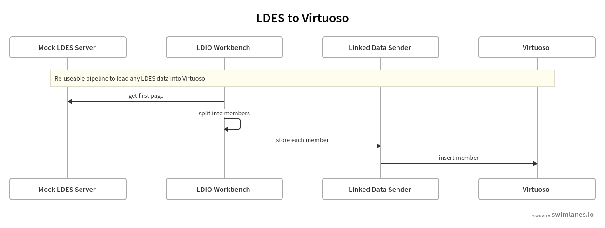
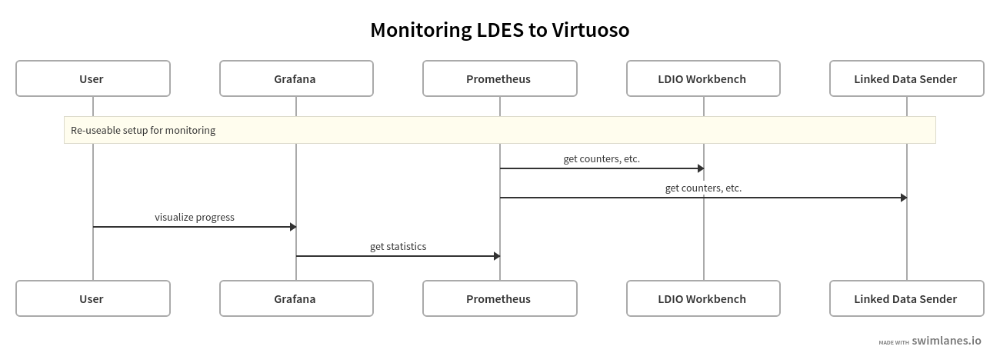

# Seed LDES Data Dump Into a Virtuoso Graph Database
This setup allows to seed a Virtuoso  Graph Database with data from [LBLOD Hakathon Wave 2 IPDC LDES Dumps](https://github.com/lblod/Semantics-YourFingertips-hackathon-wave-2-IPDC-LEDS-dumps/tree/master) using [LDIO](https://github.com/Informatievlaanderen/VSDS-Linked-Data-Interactions/tree/main) and a [custom node.js micro-service](./rdf-seeder/).

## Setup
Before we can seed the data we need to retrieve it (from github). After that we rename the files and fix the LDES relations withing the files to allow to statically host them. Finally we launch all the services.

To start the system:
```bash
./setup.sh
```

## Seeding
We seed our Virtuso Graph Database using a [LDIO pipeline](./workbench/client-pipeline.yml) which contains a LDES client that reads the first page (pageNumber=0) and follows the contained link to the next page until the complete LDES is read. The LDES client simply forwards each member to a custom service using HTTP. This RDF seeder simply accepts the member as N-triples and inserts them into a configured named graph into the Virtuoso. We can kickoff the process by sending the pipeline to the LDIO workbench which automatically starts the pipeline.



```bash
./seed.sh
```

We can follow the process in [Grafana](http://localhost:3000) (login using the configured [credentials](./.env)) by using the [IPDC dashboard](./grafana/IPDC-dashboard.json). We can import this dashboard after we create a data source for the prometheus service (http://prometheus:9090). The actual data can be found in the Virtuoso [SPARQL](http://localhost:8890/sparql) endpoint.



## Tear Down
To stop all systems:
```bash
./teardown.sh
```
